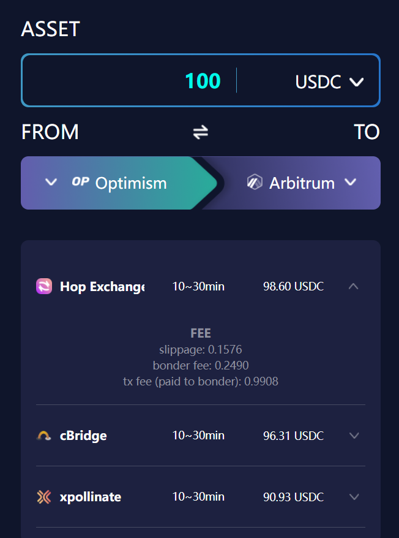

# BridgeEye - DeFiEye Cross-Chain Bridge Tool

### [https://tools.defieye.io/bridge/](https://tools.defieye.io/bridge/)

Finding lowest fee bridge to cross your asset!

## Supported Bridges

Sorted by alphabetical order.

- [Across.to](https://across.to/)
- [Allbridge](https://app.allbridge.io/bridge)
- [Anyswap Bridge](https://anyswap.exchange/bridge#/bridge)
- [Anyswap Router](https://anyswap.exchange/bridge#/router)
- [cBridge](https://cbridge.celer.network/#/transfer)
- [Hop Exchange](https://app.hop.exchange/send?token=USDC)
- [Orbiter](https://www.orbiter.finance/)
- [Relay](https://app.relaychain.com/#/cross-chain-bridge-transfer)
- [RenBridge](https://bridge.renproject.io/mint)
- [Terra Bridge](https://bridge.terra.money/)
- [xpollinate](https://www.xpollinate.io/)

Besides, we also supported many CEXes, including:

- [AscendEx](https://ascendex.com/)
- [Binance](https://www.binance.com/)
- [Bybit](https://www.bybit.com/)
- [FTX](https://ftx.com/)
- [Gate.io](https://www.gate.io/)
- [Hotbit](https://www.hotbit.io/)
- [Huobi](https://www.huobi.com/)
- [KuCoin](https://www.kucoin.com/)
- [MXC](https://www.mexc.com/)
- [OKEx](https://www.okex.com/)

## Architecture

- Crawler: `crosschain/*.py` fetch the targeted bridges fee info, and save data to txt
- Backend: `app/main.py` provides API services
- Frontend: to be released soon