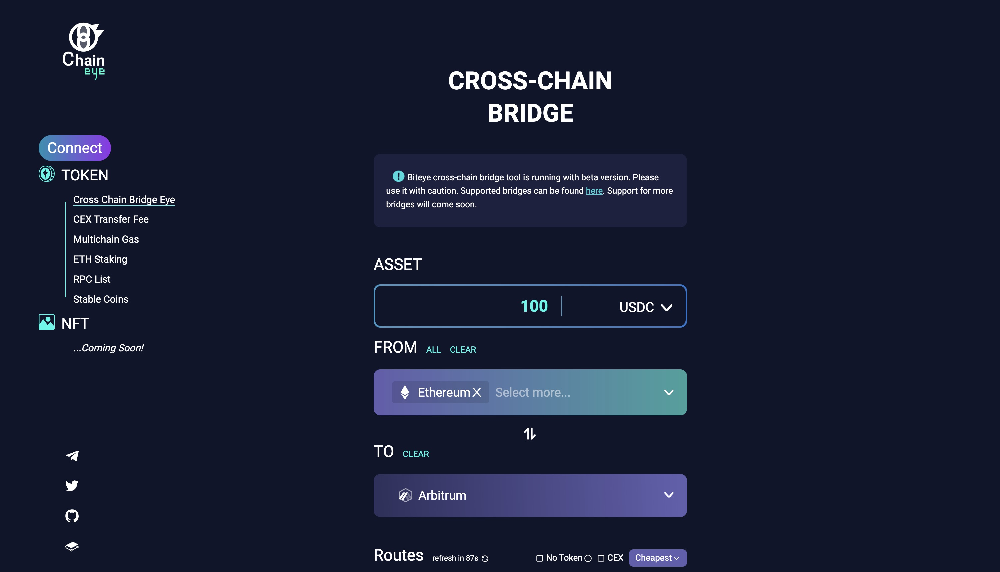

# BridgeEye - DeFiEye Cross-Chain Bridge Tool

### [https://chaineye.tools/](https://chaineye.tools/)

Finding lowest fee bridge to cross your asset!

## Supported Bridges

Sorted by alphabetical order. Detailed supporting status can be found at [wiki page](https://github.com/DeFiEye/BridgeEye/wiki).

- [Across.to](https://across.to/?referrer=0xC97ef929064EEA62D2e7d71c231F335fAC77B819)
- [Allbridge](https://app.allbridge.io/bridge)
- [Multichain](https://app.multichain.org/#/router)
- [Multichain](https://app.multichain.org/#/router)
- [Binance Bridge](https://www.binance.org/en/bridge)
- [cBridge](https://cbridge.celer.network/#/transfer?ref=0x84f0aa29864ffd6490fc98d1e2dfa31a94569cbc)
- [debridge](https://app.debridge.finance/deswap)
- [evodefi](https://bridge.evodefi.com/)
- [Hyphen](https://hyphen.biconomy.io/bridge)
- [metamask](https://portfolio.metamask.io/bridge)
- [Polygon Official](https://wallet.polygon.technology/bridge)
- [Rainbow Bridge](https://rainbowbridge.app/transfer)
- [Relay](https://app.relaychain.com/#/cross-chain-bridge-transfer)
- [RenBridge](https://bridge.renproject.io/mint)
- [Terra Bridge](https://bridge.terra.money/)
- [viaprotocol](https://router.via.exchange/)
- [Connext Bridge](https://bridge.connext.network/)
- [Orbiter](https://www.orbiter.finance/)
- [Hop Exchange](https://app.hop.exchange/send?token=USDC)
- [lifinance](https://transferto.xyz/swap)
- [Meson](https://meson.fi/ut-chaineye)
- [stargate](https://stargate.finance/transfer)
- [bungee](https://bungee.exchange/)
- [Synapse Bridge](https://synapseprotocol.com/)

Besides, we also supported many CEXes, including:

- [AscendEx (CEX)](https://ascendex.com/)
- [Binance (CEX)](https://www.binance.com/)
- [Bybit (CEX)](https://www.bybit.com/)
- [crypto.com (CEX)](https://crypto.com/exchange)
- [FTX (CEX)](https://ftx.com/)
- [Gate.io (CEX)](https://www.gate.io/)
- [Hotbit (CEX)](https://www.hotbit.io/)
- [Huobi (CEX)](https://www.huobi.com/)
- [KuCoin (CEX)](https://www.kucoin.com/)
- [MXC (CEX)](https://www.mexc.com/)
- [OKX (CEX)](https://www.okx.com/)
- [Pionex (CEX)](https://www.pionex.com/)

## Architecture

- Crawler: `crosschain/*.py` fetch the targeted bridges fee info, and save data to txt
- Backend: `app/main.py` provides API services
- Frontend: to be released soon
